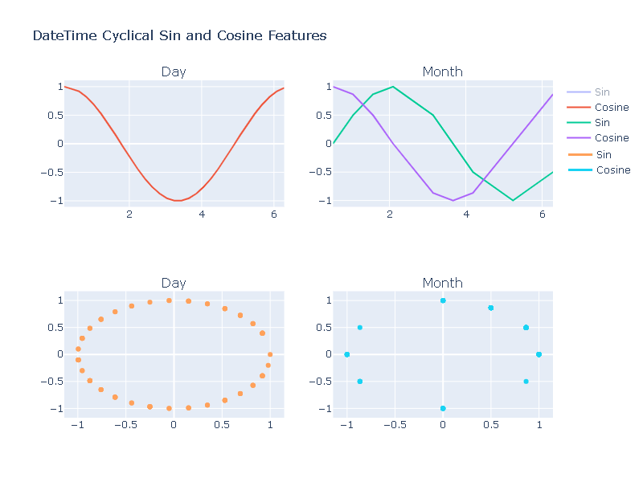

# Tanzanian Ministry of Water Analysis

### Introduction to the Competition

Hosted by DrivenData the competition entered asks given data from Taarifa and the Tanzanian Ministry of Water predict whether or not a water pipe will be functional, functional needs some repairs, or non-functional. The initial inspiration of this competition came from a real need to distribute Tanzania’s limited resources to repair pipes that are in the most critical condition and limit the number of resources used on water pipes likely to still be functional.

After analysis and modeling, the submitted model received an accuracy score of 0.8036 ranking it at 2818 out of 12798 competitors. The competition can be found on DrivenData [Here](https://www.drivendata.org/competitions/7/pump-it-up-data-mining-the-water-table/)

**Gallary**



Graph of the Sine and Cosine DateTime mapping discussed in the feature engineering section of this readme

### Usage

**Python Notebooks**

Located in the “notebooks” directory of this repository are the following “.ipynb” files:

TMW Dataset Analysis.ipynb
TMW Dataset Modeling.ipynb

These files explore the data analysis and predictive modeling aspects of this project. The “TMW Dataset Analysis.ipynb” file contains work on data wrangling and feature engineering. The “TMW Dataset Modeling.ipynb” contains work done on data preprocessing, hyperparameter tuning, and model analysis.

**The Interactive Model**

For demonstration purposes, the work done in the python notebooks has been implemented into an interactive dash web application hosted on Heroku servers. The web application hosts a modified predictive Random Forest Classification model that outputs if a water pipe is functional, functional needs repairs, or non-functional given how the website user adjusts the input sliders. The structure of the dash application is set up where the “run.py” file houses all components laid out on the web page. “App.py” hosts the server and stylesheet. The pages directory hosts the “index.py” and “predictions.py” files that return layouts to the “run.py” file.

The deployed predictive model can be interacted with [Here](https://tanzanian-waterpipe-analysis.herokuapp.com/)

# Overview of the Tanzanian Water Pipe Data Analysis and Predictive Modeling Process

### Analysis

**The Dataset**

The Tanzanian Ministry of Water dataset has a shape of 59,400 observations (rows) and 41 features (columns). The dataset includes information collected by field agents that inspect water pipes periodically. Field agents record many descriptive features of the water pipes such as water quality, GPS location, and waterpipe installer. The feature “status_group” can be identified as a target feature since it describes a given water pipe observation as functional, functional needs repair, or non-functional. 

**Data Wrangling**

The use of field agents to record observations of each water pipe creates inconsistencies in the dataset. The majority of features in the dataset are repetitive and have missing values. Methods used to handle these problematic features are a combination of feature dropping and observation imputing. Using agents to enter data while actively in the field also prevents complex features to be recorded that are potentially useful during analysis. Feature engineering is used to construct new features that add to the predictive performance and overall understanding of the dataset.

**Dropping Values**

The process for identifying repetitive features is manual involving the comparison of value counts between each column. Features such as source, source_type, and source_class after inspection are found to be similar and the small differences in their content do not justify the extra dimensionality created by leaving them in the dataset. In cases such as this only one of the features is kept and the rest are removed from the dataset. With aid from the pandas and missingno libraries, the process for identifying missing values proved successful. Features found to have more than 50 percent of its observations missing were also removed from the dataset. Of the original 41 features, 22 features were removed based on repetitiveness and missing values.

**Numerical Features**

Eight of the remaining nineteen features are numerical. Many of the features still contain a relatively small amount of missing values (NaNs). These values are imputed with a process using scikit-learn’s [K-Neighest-Neighbors Imputer](https://scikit-learn.org/stable/modules/generated/sklearn.impute.KNNImputer.html) that imputes based on comparing an observation with a missing value to neighboring observations that have other similar values for a given feature. The neighboring observation with the most similar values when comparing features is used to impute the missing value for the current observation. The result is a processed dataset with no missing values in the numerical columns.

**Categorical Features**

Eleven of the remaining nineteen features are categorical, this includes the target “status_group” feature. Categorical values are encoded into a numerical format and missing values are imputed. For this dataset, features are encoded with an ordinal encoding process that preserves NaN values. Features are imputed with scikit-learn’s experimental [Iterative Imputer](https://scikit-learn.org/stable/modules/generated/sklearn.impute.IterativeImputer.html) that aims to fill in missing values through a “round-robin” approach of modeling a feature with missing values as a function of other features. The result is a fully encoded dataset without any missing values in categorical columns.

**Feature Engineering**

Complex features are created through the process of modifying or combining existing features. The result of feature engineering transforms the Tanzanian dataset into a dense dataset containing more specialized information for analysis and modeling. Features created are ones that result from the breakdown of the DateTime column to express the cyclical nature of its values, as well as the years since constructed column.

**DateTime**

The DateTime feature after formatting contains information on the date of when a water pipe was last observed by a field agent. One issue that arises from the DateTime object is a lack of connection between values that describe the beginning of a calendar date and values that are towards the end of a calendar date (the cycling nature of calenders 1-30 for days, 1-12 for months). An observation witnessed at the end of the year and one at the beginning of the year do not have a strong link, the observations are separated numerically by twelve months when it needs to be shown that separation is only by one month. To solve this the DateTime feature can be mapped onto sine and cosine waves to represent the cyclical nature of the dates.

**Years Since Constructed**

Taking the year that the water pipe was originally constructed and the date that the water pipe was last observed, the two features are merged into one representing the years since the initial construction. The result of this feature reduces dimensionality by combining two relatively weak features that give little insight during analysis into a single feature that is descriptive and relevant.

### Modeling

**Baseline Model**

To benchmark progress with predictive modeling, a baseline model is initialized to be compared to more complex modeling processes. For the baseline model, the values of the target feature in the dataset are counted (function, non-functional). The target feature was found to have 61 percent of its values as “functional” and 39 percent of its values as “non-functional”. Given this, the minimum score of the baseline model is 61 percent accuracy if a model was created that always assumed a water pump is functional.

**Data Preprocessing Pipeline**

In order for different predictive model outputs to be compared the data fed into each model needs to be standardized so that differences in model scores are from model architecture and not from differences in the data. Durning the dataset analysis several data wrangling techniques were used to understand the information. For predictive modeling, the data wrangling processes used during analysis are adopted into a data preprocessing pipeline. The pipeline takes in raw data from the Tanzanian Ministry of Water and processes it to no longer have NaN values, drops unneeded features, encodes values, and creates new features. The dataset after preprocessing exists in a standardized format.

**Hyperparameter Tuning**

Before a given model’s score can be compared against other models a process of hyperparameter tuning needs to be conducted to ensure that each model architecture is tuned to best handle the dataset. The tuning process is different for each model and involves brute force testing of the model's different parameters. The parameters that return the highest accuracy score for the data are used. The classification model architectures tested in this analysis are Decision Trees, Random Forests, Logistic Regression, ADA Boosting, and Gradient Boosting. The highest scoring model after hyperparameter tuning is the Random Forest Classifier.

The [Decision Tree](https://scikit-learn.org/stable/modules/tree.html) model architecture was found to have a highest accuracy score of 76 percent when the tested input parameters are set at the following:

```
 {'splitter': 'best', 'min_samples_leaf': 3, 'max_leaf_nodes': None,
  'max_features': None, 'max_depth': 21, 'criterion': 'entropy'}
```

The [Random Forest](https://scikit-learn.org/stable/modules/generated/sklearn.ensemble.RandomForestClassifier.html) model architecture was found to have a highest accuracy score of 80% when the tested input parameters are set at the following:

```
{'warm_start': False, 'n_jobs': 2, 'n_estimators': 31, 
 'max_samples': None, 'max_features': 'sqrt', 'criterion': 'entropy'}
```

The [Logistic Regression](https://scikit-learn.org/stable/modules/generated/sklearn.linear_model.LogisticRegression.html) model architecture was found to have a highest accuracy score of 59% when the tested input parameters are set at the following:

```
{'penalty': 'l2'}
```

The [ADA Boosting](https://scikit-learn.org/stable/modules/generated/sklearn.ensemble.AdaBoostClassifier.html) model architecture was found to have a highest accuracy score of 69% when the tested input parameters are set at the following:

```
{'n_estimators': 11, 'learning_rate': 1.5, 'algorithm': 'SAMME.R'}
```

The [Gradient Boosting](https://scikit-learn.org/stable/modules/generated/sklearn.ensemble.GradientBoostingClassifier.html) model architecture was found to have a highest accuracy score of 77% when the tested input parameters are set at the following:

```
{'n_estimators': 150, 'learning_rate': 0.5}
```
